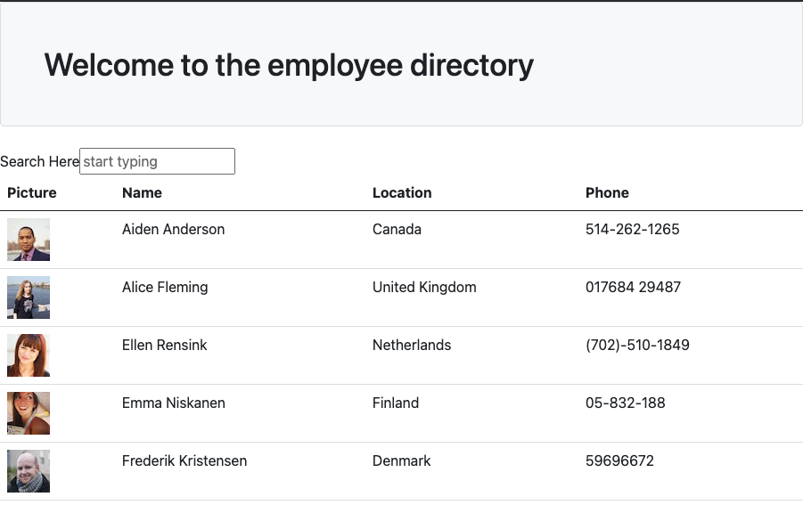

# userdirectory

## Description

This application was built in order to filter through a large list of employees/users. Start typing in the search bar and the list will be filtered down by the person's first name. Click on one of the headings and the list will be sorted in ascending order according to the section selected. A live link can be viewed [HERE](https://git.heroku.com/radiant-oasis-26121.git)

## Table of Contents

- [Installation](#Installation)
- [Usage](#Usage)
- [Badges](#Badges)
- [Questions](#Questions)

## Installation

In order to run the program, you'll first have to fork the repo. In the terminal you'll run npm install to install all dependencies.

## Usage

While in the project's root folder, in the terminal, you'll type

    npm start

Once the app is running on port 3000, you'll use your internet brower to navigate to [localhost:3000](http://localhost:3000/)

## Badges

## Questions

If you have any questions, reach out to me through my [Github](www.github.com/levickane) .
